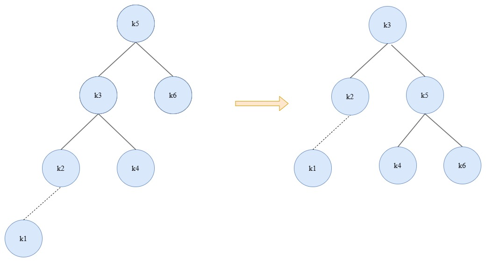
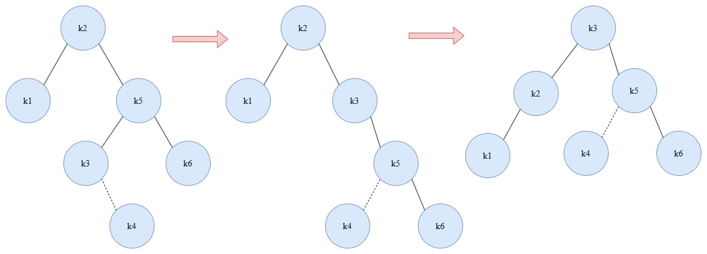
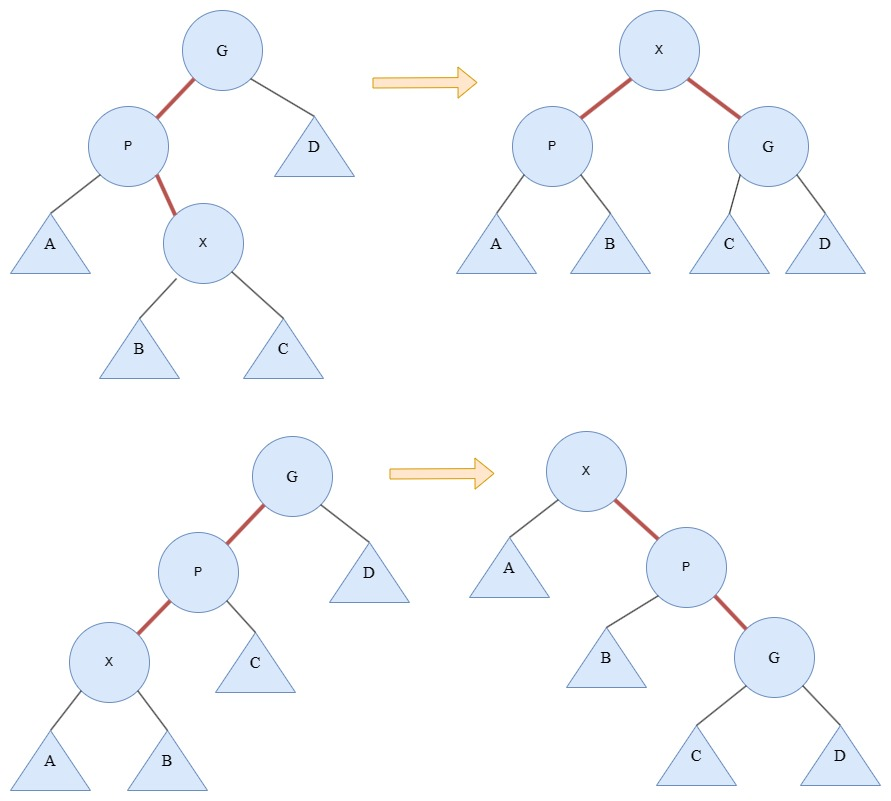

# 树

## 前置知识

树是计算机中的一个抽象概念，形式上是递归的N个节点和N-1条边的集合，且每一条边都连接着一个相同的节点。这个特殊节点称为其他相连节点的父，其他相连节点是这个节点的子。特殊地，最开始的节点称为当前树的根节点，最终的没有子的节点称为叶。

从一个节点n1到另一个节点nk的**路径**定义为节点n1，n2，... ，nk的一个序列，使得ni总是ni+1的父。这条路径的长度就是边的数量，即k-1。

任意节点的**深度**是从根节点到该节点的唯一路径的长度。根节点的深度是0。

节点的**高**是从该节点到一个叶子节点的最长的路径长度。整棵树的高度就等于根节点的高度。所有叶子节点的高是0。
可以理解为，深度就是从根节点开始数到某节点的路径长度；高就是叶子节点到某节点的路径长度。

## 二叉树

### 结构

顾名思义，二叉树就是每个节点都有且仅有两个子的树。
```c++
template<typename T>
struct BinaryNode {
    T data;

    BinaryNode<T>* left{ nullptr };
    BinaryNode<T>* right{ nullptr };    
};

class BinaryTree {
public:
    BinaryTree() = default;

    virtual ~BinaryTree();

public:
    BinaryNode<T>* m_root{ nullptr };
};
```
例如上述代码，`BinaryNode`是节点，保存了当前节点的数据，然后还有两个指针分别指向了自己的左右儿子。`BinaryTree`只需要保存根节点的指针，这样就是一个简单的二叉树。

### 遍历方式

对于二叉树而言，遍历可分为三种：前序遍历、中序遍历和后序遍历。前序遍历就是首先查看当前节点的数据，然后再分别查看两个子节点的数据（如果有的话）；中序遍历就是先查看一个子节点的数据，然后再查看当前节点的数据，最后再查看另外一个子节点的数据；后序遍历就是先查看两个子节点的数据，最后再查看当前节点的数据。对于每个节点都递归地使用同样的逻辑进行查看数据。
二叉树的递归遍历实现起来不是很困难，基本上就是换个代码的执行顺序。用迭代的方式来实现一下，也算是一种加深理解的训练吧。（理论上，所有的递归逻辑代码都可以转换成迭代的方式，反之亦然。借用哪里看到过的一句话，“*迭代是人，递归是神！*”）。
```c++
// 前序遍历
template<typename T>
inline void BinaryTree<T>::preOrder(BinaryNode<T>* root, std::ostream& out) {
    std::stack<BinaryNode<T>*> nodes;
    nodes.push(root == nullptr ? m_root : root);
    BinaryNode<T>* cur;
    while(!nodes.empty()) {
        cur = nodes.top();
        nodes.pop();
        out << cur->data << " ";
        if(cur->right != nullptr) {
            nodes.push(cur->right);
        }
        if(cur->left != nullptr) {
            nodes.push(cur->left);
        }
    }
}

// 中序遍历
template<typename T>
inline void BinaryTree<T>::postOrder(BinaryNode<T>* root, std::ostream& out) {
    std::stack<BinaryNode<T>*> nodes;
    nodes.push(root == nullptr ? m_root : root);
    std::stack<BinaryNode<T>*> print_nodes;
    BinaryNode<T>* cur;
    while(!nodes.empty()) {
        cur = nodes.top();
        nodes.pop();
        print_nodes.push(cur);
        if(cur->left != nullptr) {
            nodes.push(cur->left);
        }
        if(cur->right != nullptr) {
            nodes.push(cur->right);
        }
    }
    while(!print_nodes.empty()) {
        out << print_nodes.top()->data << " ";
        print_nodes.pop();
    }
}

// 后序遍历
template<typename T>
inline void BinaryTree<T>::middleOrder(BinaryNode<T>* root, std::ostream& out) {
    std::stack<BinaryNode<T>*> nodes;
    BinaryNode<T>* cur = root == nullptr ? m_root : root;
    while(!nodes.empty() || cur != nullptr) {
        while(cur != nullptr) {
            nodes.push(cur);
            cur = cur->left;
        }
        out << nodes.top()->data << " ";
        cur = nodes.top()->right;
        nodes.pop();
    }
}
```
可以看到，迭代的实现方式确实看起来比较啰嗦，没有递归来的简洁和优雅（效率的话，应该是差不多的），也再一次印证了上述引用的那句话。

## 二叉搜索树

二叉搜索树是对二叉树的进一步优化的约束，二叉树太过于原始，数据被插入了就是被插入了，如果我们要找的话，基本就得从头遍历一遍所有二叉树的节点，这在某些场景下是不可被接受的。二叉搜索树添加了一条新的规则，在原有二叉树的基础上，规定左儿子的值一定是小于当前节点的，右儿子的值一定是大于当前节点的。这样再查找的时候就可以通过比较，将时间复杂度从O(n)降到O(logn)了，当然，这也意味着在插入的时候也需要多一点的操作。
直接看实现。
```c++
template<typename T>
class BinarySearchTree : private BinaryTree<T> {
public:
    enum class Order : char {
        pre,
        middle,
        post
    };

    virtual ~BinarySearchTree() = default;

    void insert(const T& val);

    void insert(T&& val);

    void remove(const T& val);

    void printTree(std::ostream& out = std::cout, Order ord = Order::pre) const;

    const T& findMin() const;

    const T& findMax() const;

    bool contains(const T& x) const;

    bool isEmpty() const;

    void clear();

private:
    void insert(const T& val, BinaryNode<T>* node);

    void insert(T&& val, BinaryNode<T>* node);

    void remove(const T& val, BinaryNode<T>* node);

    BinaryNode<T>* findMin(BinaryNode<T>* node) const;

    BinaryNode<T>* findMax(BinaryNode<T>* node) const;

    bool constains(const T& val, BinaryNode<T>* node) const;
};

template<typename T>
inline bool BinarySearchTree<T>::contains(const T& x) const {
    return constains(val, m_root);
}

template<typename T>
inline bool BinarySearchTree<T>::isEmpty() const {
    return m_root == nullptr;
}

template<typename T>
inline void BinarySearchTree<T>::clear() {
    clear(m_root);
}

template<typename T>
inline void BinarySearchTree<T>::insert(const T& val, BinaryNode<T>* node) {
    if(node == nullptr) {
        node = new BinaryNode<T>;
        node->data = val;
        return;
    }
    if(val > node->data) {
        insert(val, node->right);
    }
    else if(val < val->data) {
        insert(val, node->left);
    }
}

template<typename T>
inline void BinarySearchTree<T>::insert(T&& val, BinaryNode<T>* node) {
    if(node == nullptr) {
        node = new BinaryNode<T>;
        node->data = std::move(val);
        return;
    }
    if(val > node->data) {
        insert(std::forward(val), node->right);
    }
    else if(val < val->data) {
        insert(std::forward(val), node->left);
    }
}

template<typename T>
inline void BinarySearchTree<T>::remove(const T& val, BinaryNode<T>* node) {
    if(node == nullptr) {
        return;
    }
    if(val < node->data) {
        remove(val, node->left);
    }
    else if(val > node->data) {
        remove(val, node->right);
    }
    else if(node->left != nullptr && node->right != nullptr) {
        // 有两个儿子，先找到右儿子的最小值，然后交换
        node->data = findMin(node->right)->data;
        remove(node->data, node->right);
    }
    else {
        // 只有一个儿子，把儿子提上来就行了
        BinaryNode<T> old = node;
        node = node->left != nullptr ? node->left : node->right;
        delete old;
    }
}

template<typename T>
inline BinaryNode<T>* BinarySearchTree<T>::findMin(BinaryNode<T>* node) const {
    if(node->left != nullptr) {
        return findMin(node->left);
    }
    return node;
}

template<typename T>
inline BinaryNode<T>* BinarySearchTree<T>::findMax(BinaryNode<T>* node) const {
    if(node->right != nullptr) {
        return node->right;
    }
    return node;
}

template<typename T>
inline bool BinarySearchTree<T>::constains(const T& val, BinaryNode<T>* node) const {
    if(node == nullptr) {
        return false;
    }
    if(val < node->data) {
        return constains(val, node->left);
    }
    else if(val > node->data) {
        return constains(val, node->right);
    }
    return true;
}

template<typename T>
inline void BinarySearchTree<T>::insert(const T& val) {
    insert(val, m_root);
}

template<typename T>
inline void BinarySearchTree<T>::insert(T&& val) {
    insert(val, m_root);
}

template<typename T>
inline void BinarySearchTree<T>::remove(const T& val) {
    remove(val, m_root);
}

template<typename T>
inline void BinarySearchTree<T>::printTree(std::ostream& out, Order ord) const {
    if(ord == Order::pre) {
        preOrder(m_root, out);
    }
    else if(ord == Order::middle) {
        middleOrder(m_root, out);
    }
    else {
        postOrder(m_root, out);
    }
}

template<typename T>
inline const T& BinarySearchTree<T>::findMin() const {
    return find(m_root)->data;
}

template<typename T>
inline const T& BinarySearchTree<T>::findMax() const {
    return find(m_root)->data;
}
```
`BinarySearchTree`继承了之前写的`BinaryTree`，公有部分是提供的外部接口，实际的操作会由私有部分的代码来实现，算是一种良好的代码规范吧。
实例代码中仅实现了二叉搜索树的部分功能，比如重要的插入和删除，也应该足够展示二叉搜索树的特性了。
就如二叉搜索树的定义一样，插入使用递归的方式，比较要插入的数据和当前节点数据的大小关系，然后决定是插入还是继续向下遍历。
比较困难的是删除操作，如果我们要删除一个节点的数据，需要分类讨论一下：如果是叶子节点，当然可以直接删掉；如果只有一个儿子，也很好办，直接将儿子节点和父节点连接起来就可以了；如果有两个儿子，就不那么好办了，思考一下，将当前的节点的删除了，那么应该是子节点及以后的节点中的哪个来接替它的位置？
假设左节点是比当前节点小，右节点是比当前节点大，那么换上来的节点也不能够破坏这种关系，所以需要用比当前节点大的节点中的最小节点来替换。想到这就好办了，直接在右节点中去搜索最小节点，然后覆盖当前节点，最后再把多余的那个删除掉就大功告成了。（很显然，删除的操作代价还是比较大的，所以往往采用更有效率的“懒删除”方式，也就是当有节点要删除时，先不直接删除，而是打上一个标识来代表删除，如果后面再有相同数据的添加时，再把标识去掉就好了）。

## AVL树

> AVL树是带有平衡条件的二叉搜索树，平衡条件必须要容易保持，而且它保证树的深度是O(logn)的。一种思路是要求根节点的左右子树是深度相同的，不要求树的深度要浅，这样的意义其实并不大。另一种思路是要求每个节点都必须要有相同高度的左右子树，如果空子树的高度定义为-1（约定俗称），那么只有具有2^k^-1个节点的*理想平衡树*满足这个标准，显然，虽然这个条件保证了树的深度最小，但是它太过严格了以至于难以使用。

将第二种思路放宽条件，允许每个节点的左右子树的**高度最多差1**的二叉搜索树称为AVL(Adelson-Velsii和Landis)树。

### 旋转

根据定义，AVL树总可以保证除了插入和删除以外的操作都可以在O(logn)的时间复杂度内完成。而插入和删除时，需要更新通向根节点的路径上所有节点的平衡信息，这意味着插入一个节点，可能会破坏AVL树的特性（例如向深度最大的节点再插入一个节点时，可能就会导致这个节点的高度=兄弟节点高度+2，这违反了定义）。
```c++
/**
        node0
        /  \
    node1   node2
              \
               node3
 */
```
当向node3再插入一个节点时，就会破坏AVL树的特性。

为了恢复平衡的性质，需要对树进行简单的修正，称为*旋转*。
把需要重新平衡的节点记作**α**，不平衡的情况则可以分成以下四种情况：
1. 对**α**的左儿子的左子树进行了一次插入。
2. 对**α**的左儿子的右子树进行了一次插入。
3. 对**α**的右儿子的左子树进行了一次插入。
4. 对**α**的右儿子的右子树进行了一次插入。

情况1和情况4是一组镜像，情况2和情况3也是一组镜像。对于儿子和孙子在同一边的情况(1和4)可以通过一次单旋转搞定；而对于不在同一边的情况(2和3)需要进行两次旋转(双旋转)来解决。

#### 单旋转



如图中展示的这样，在插入K1时，k5节点的左树高度比右树高度高2，已经不满足了AVL树的性质，需要进行一次旋转操作来保持AVL树的特性。分析当前情形，在插入后不满足条件的是k5，原因是在左子树中插入了一个更小的节点，也就是往左子树的左子树又插入了一个左节点。那么为了保持特性，就需要左子树的高度降低，把左儿子升上来，当前节点降下去，就等于左子树高度减一，右子树高度加一，变成右边的形式，这样就重新得到了一个AVL树。看起来就像是抓住左儿子不动，将树顺时针旋转了一下。
同理，之前也说了情况4和情况1是一对镜像操作，那么当向右儿子的右儿子插入一个右节点，导致AVL失衡时，就可以抓住右儿子不动，逆时针旋转一下，重新获得平衡。

实现代码
```c++
template<typename T>
inline void AvlTree<T>::rotateWithLeftChild(shared_ptr<Node<T>>& node) {
    auto tmp = node->left;
    node->left = tmp->right;
    tmp->right = node;
    node->height = std::max(high(node->left), high(node->right)) + 1;
    tmp->height = std::max(high(tmp->left), high(tmp->right)) + 1;
    node = tmp;
}

template<typename T>
inline void AvlTree<T>::rotateWithRightChild(shared_ptr<Node<T>>& node) {
    auto tmp = node->right;
    node->right = tmp->left;
    tmp->left = node;
    node->height = std::max(high(node->left), high(node->right)) + 1;
    tmp->height = std::max(high(tmp->left), high(node->right)) + 1;
    node = tmp;
}
```
`rotateWithLeftChild`表示左子树的高度过高，需要对左子树进行旋转，`rotateWithRightChild`表示右子树的高度过高，需要对右子树进行旋转，实际上就是交换了当前节点和过高节点的位置，然后需要将位置变换了的节点重新计算一下高度。

#### 双旋转



如左图所示，在插入k4节点的时候，此时k5的高度是2，k1的高度是0，导致k2节点再次不满足了AVL树的定义，那么我们想和上次一样，如果能够抓住k5进行旋转就好了，但可惜的是不太可行，因为此时的k5的子已经满了，如果以k5为基准来旋转，那么势必需要操作三个节点(k2、k5、k3)，还是挺麻烦的。退而求其次，如果能将当前的情况经过一次操作，变成更简单的形式，就算是离成功更近了一步，因为是k3的深度太深了，导致不太好旋转，那就把它拿上去，于是得到了中间的形态。这时我们再观察能发现，这是我们熟悉的情形——情况4，那么顺势再进行一次旋转，整棵AVL树又重新获得了平衡。

实现代码
```c++
template<typename T>
inline void AvlTree<T>::doubleRotateWithLeftChild(shared_ptr<Node<T>>& node) {
    rotateWithRightChild(node->left);
    rotateWithLeftChild(node);
}

template<typename T>
inline void AvlTree<T>::doubleRotateWithRightChild(shared_ptr<Node<T>>& node) {
    rotateWithLeftChild(node->right);
    rotateWithRightChild(node);
}
```
正如分析的一样，双旋转就是旋转两次，先将导致不平衡的过深的节点转上来，再经过一步单旋转就可以获得平衡。每一步都只是父子两个节点之间的操作，这不难完成。

## 插入和删除

完整的插入和删除逻辑
```c++
template<typename T>
struct Node {
    T value;
    shared_ptr<Node<T>> left{ nullptr };
    shared_ptr<Node<T>> right{ nullptr };
    int height{ 0 };

    explicit Node(T val) : value(val) { }
    virtual ~Node() = default;
};

template<typename T>
class AvlTree {
public:
    AvlTree() = default;
    explicit AvlTree(T val);
    virtual ~AvlTree() = default;

    shared_ptr<Node<T>> root() const;

    void insert(const T& val);

    void remove(const T& val);
    
private:
    void insert(const T& val, shared_ptr<Node<T>>& node);

    void remove(const T& val, shared_ptr<Node<T>>& node);

    void balance(shared_ptr<Node<T>>& node);

    void rotateWithLeftChild(shared_ptr<Node<T>>& node);

    void rotateWithRightChild(shared_ptr<Node<T>>& node);

    void doubleRotateWithLeftChild(shared_ptr<Node<T>>& node);

    void doubleRotateWithRightChild(shared_ptr<Node<T>>& node);

    int high(const shared_ptr<Node<T>>& node) const;

    shared_ptr<Node<T>> findMin(shared_ptr<Node<T>>& node);

private:
    shared_ptr<Node<T>> m_root{ nullptr };
};

#endif // !avltree.hpp

template<typename T>
inline AvlTree<T>::AvlTree(T val) : m_root{std::make_shared<Node>(val)} { }

template<typename T>
inline shared_ptr<Node<T>> AvlTree<T>::root() const {
    return m_root;
}

template<typename T>
inline void AvlTree<T>::insert(const T& val) {
    insert(val, m_root);
}

template<typename T>
inline void AvlTree<T>::remove(const T& val) {
    remove(val, m_root);
}

template<typename T>
inline int AvlTree<T>::high(const shared_ptr<Node<T>>& node) const {
    return node == nullptr ? -1 : node->height;
}

template<typename T>
inline shared_ptr<Node<T>> AvlTree<T>::findMin(shared_ptr<Node<T>>& node) {
    if(node->left == nullptr) {
        return node;
    }
    return findMin(node->left);
}

template<typename T>
inline void AvlTree<T>::insert(const T& val, shared_ptr<Node<T>>& node) {
    if(node == nullptr) {
        node = std::make_pair<Node<T>>(val);
    }
    else if(val < node->value) {
        insert(val, node->left);
    }
    else if(val > node->value) {
        insert(val, node->right);
    }
    balance(node);
}

template<typename T>
inline void AvlTree<T>::remove(const T& val, shared_ptr<Node<T>>& node) {
    if(node == nullptr) {
        return;
    }
    if(val < node->value) {
        remove(val, node->left);
    }
    else if(val > node->value) {
        remove(val, node->right);
    }
    else if(node->left != nullptr && node->right != nullptr) {
        // 两个子的情况
        node->value = findMin(node->right)->value;
        remove(node->value, node->right);
    }
    else {
        // 只有一个子
        node = node->left == nullptr ? node->right : node->left;
    }
    balance(node);
}

template<typename T>
inline void AvlTree<T>::balance(shared_ptr<Node<T>>& node) {
    if(node == nullptr) {
        return;
    }
    if(high(node->left) - high(node->right) > 1) {
        high(node->left->left) >= high(node->left->right) ?
            rotateWithLeftChild(node) : doubleRotateWithLeftChild(node);
    }
    else if(high(node->right) - high(node->left) > 1) {
        high(node->right->left) >= high(node->right->right) ?
            doubleRotateWithRightChild(node) : rotateWithRightChild(node);
    }
    node->height = std::max(high(node->left), high(node->right)) + 1;
}

template<typename T>
inline void AvlTree<T>::rotateWithLeftChild(shared_ptr<Node<T>>& node) {
    auto tmp = node->left;
    node->left = tmp->right;
    tmp->right = node;
    node->height = std::max(high(node->left), high(node->right)) + 1;
    tmp->height = std::max(high(tmp->left), high(tmp->right)) + 1;
    node = tmp;
}

template<typename T>
inline void AvlTree<T>::rotateWithRightChild(shared_ptr<Node<T>>& node) {
    auto tmp = node->right;
    node->right = tmp->left;
    tmp->left = node;
    node->height = std::max(high(node->left), high(node->right)) + 1;
    tmp->height = std::max(high(tmp->left), high(node->right)) + 1;
    node = tmp;
}

template<typename T>
inline void AvlTree<T>::doubleRotateWithLeftChild(shared_ptr<Node<T>>& node) {
    rotateWithRightChild(node->left);
    rotateWithLeftChild(node);
}

template<typename T>
inline void AvlTree<T>::doubleRotateWithRightChild(shared_ptr<Node<T>>& node) {
    rotateWithLeftChild(node->right);
    rotateWithRightChild(node);
}
```
重要的是`balance`这个函数，由于我们是在从根节点向下递归，所以`balance`会从下向上执行，也就是当出现不平衡时，会执行旋转操作，然后再依次向父节点继续平衡。再次感叹，递归是种伟大的思想，是一种从计算机的视角看待问题的思想。

## 伸展树

**伸展树**是一种相对简单的树结构，它不保证单次操作的时间，但可以使得对树的任意连续M次操作最多花费O(logn)时间。
> 一般来说，当M次的操作序列总的最坏运行时间是O(Mf(N))时，我们就说它的摊还运行时间是O(f(N))。

基于这样的实践经验：如果一个节点被访问到，那么它很可能在不久的将来还会被访问。也可以说是时间局部性的一种体现。
则伸展树的基本想法是，如果一个节点被访问到了，那么我们就经过一系列的AVL树的旋转操作，将它向根推进。
但是直接的旋转操作不是特别好的方法，因为在将一个节点向根推进的时候，往往会将另外的节点推到和它之前一样的深度，而对那个节点的访问，又会将另外的节点推向深处。
然后出现了一种更好的展开的思路，与旋转类似，不过在如何旋转上有一些选择的空间。
* 如果X的父节点是根节点，那么执行一次X和根节点的旋转即可。
* 否则，X节点就会有父节点P的祖父节点G，此时会有两种情况和对应的镜像情况，
1. 三个节点之间构成“之”字形，那么执行一次AVL树类似的双旋转；
2. 三个节点之间构成“一”字形，那么依次调换父子顺序。



不难看出，在经过这种变换后，不仅将常访问的节点向根推进了，而且将访问路径上大部分节点的深度都降低了。

## B树
~~做人不能没有B树(不是)~~
上述的各种树都是在我们假设数据都是存储在内存上的，但有些情况数据过大，不能全部存在内存中(比如数据库存储数据的场景)，那么我们就需要将数据结构保存到磁盘上，这时由于磁盘和内存的操作时间相差巨大，大O模型不再适用(大O模型总是假设所有的操作都是相等的)，游戏规则变了。
我们想要的是将硬盘的访问量尽量减少到一个非常小的常数范围，比如3~4次，而且也不想去写一个非常复杂的程序(只要你的代码不是太离谱，相比硬盘的访问时间，cpu和内存执行代码的时间基本上是可以忽略不计的)。
二叉树明显是不行不行的了，因为即使是完全二叉树，最好的时间复杂度也是O(logn)。那么我们自然想到的就是增加树的分支，树的分支越多，我们就可以获得更少的硬盘访问次数。这种多叉树称为`M叉树`,时间复杂度可以是O(log<small>M</small>N)。
对于M叉树，我们需要有M-1个关键字来决定选取哪个分支，并且需要可以通过某种方式得到平衡。于是B树(B^+^树)应运而生。
M阶的B树是一棵具有如下性质的M叉树：
1. 数据项都存放在树叶上。
2. 非叶节点存储直到M-1个关键词来指示搜索方向：关键字i代表子树i+1中最小的关键字。
3. 树的根或者是叶节点，或者其儿子数在2到M之间。
4. 除根节点外，所有非叶节点的儿子数在M/2到M之间。
5. 所有的树叶具有相同的深度，并且每片树叶拥有的数据项数量在L/2和L之间，L会经过一些计算来得到。


例如，每个节点表示了磁盘的一个区块，假设一个区块的大小是8192字节(8k)，现在有1000万项记录，每个记录要256字节，每一个关键字需要32字节，那么在一棵M阶的B树中，将会有M-1个关键字，总共需要32M-32字节，还有M个分支，假设一个分支占4字节，那么一个非叶子节点的总的内存需求是36M-32字节。使得不超过8192字节的M的最大值是228，所以我们确定这棵树是一颗228叉树。因为一条记录的大小是256字节，我们可以把32个记录放在同一个区块中，从而确定了L=32。结合上述性质，我们得到了这样一棵树，它可以保证每片叶子都有16~32个数据，且每个内部节点（除根节点外）都至少会以114种方式分叉。由于有1000万数据，则至多需要625000片叶子，最坏的情况下也必然可以在第四层上找到数据，还是可以接受的。
剩下的就是B树的插入和删除问题了，这里只是简单描述下，详细的内容值得专门去探索。重复B树的性质，叶节点保存了L/2到L个数据，那么对于一个没有满的叶子插入是简单的，只要放进对应位置即可，而当对一个满了的叶子再插入一个数据时，就需要进行分裂操作，也就是将这个叶子分裂成两片叶子，分别写入到了两个区块中，然后再更新一下父节点。也就是说，对于一个分裂操作需要至少额外的两次磁盘操作（父节点如果也满了需要再向上递归分裂）。好在分裂的操作其实并不频繁，因为在一次分裂后，我们重新获得了两个装有M/2个数据的叶子，那么至少还可以进行M/2次插入操作后才会再次分裂。最坏的结果是直到根节点都满了，那么按照规则，根节点将分裂成两个，显然两个根节点是不太能接受的，那么我们就要再新建一个节点作为根节点，然后将分裂出的两个节点作为其子节点，这也是为什么性质3允许根节点有两个儿子的原因，这也是B树高度增加的唯一方式。
删除操作可以看作是插入操作的逆向，不多赘述。另外，在删除时，非叶子节点的儿子可能无法满足性质4，这时候可以通过“领养”的方式，将临近节点多的儿子放到自己节点下。
